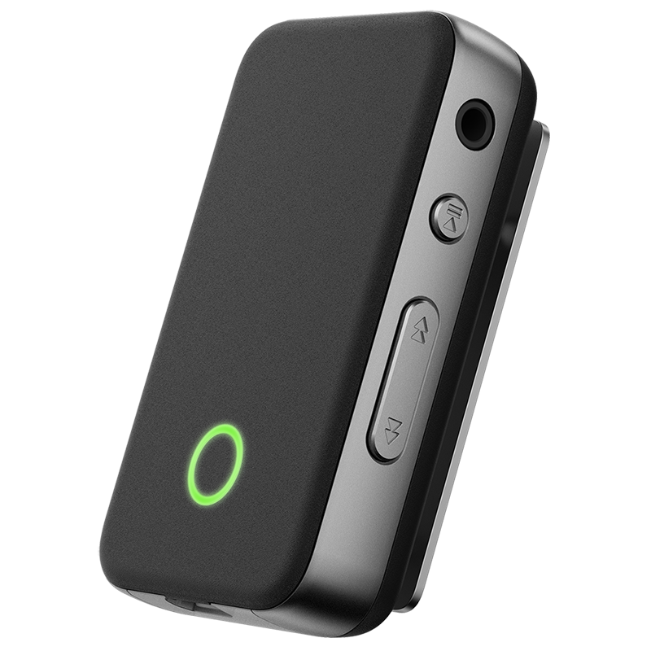

<p align="center">
  
</p>

# EarStudio Companion for macOS

**[⬇ Download for macOS — latest release](https://github.com/igorgarbuz/earstudio-mac/releases/latest)**

Choose the **`.dmg` file** under **Assets**, open it, and drag **EarStudio Companion** into **Applications**. Requires macOS 14 or newer; works on Apple Silicon and Intel Macs. [Installation help](#download-and-install).

> **First launch:** macOS marks browser downloads as quarantined. This release is **not notarized by Apple**, so macOS may block it with an “Apple could not verify” warning. Click **Done**, open **System Settings → Privacy & Security**, scroll down to **Security**, and click **Open Anyway** beside EarStudio Companion. Authenticate and confirm **Open**. [Detailed first-launch steps](#first-launch-on-macos).

A good DAC shouldn’t spend its retirement in a drawer. The discontinued **EarStudio ES100 and ES100 MK2** still have plenty to offer: 24-bit/48 kHz USB audio on a Mac, analog volume control and a balanced headphone output. But with the original iOS and Android apps gone from their stores, owners rediscovering their devices can lose access to the settings that make them so useful.[^app-availability] I built **EarStudio Companion** to give this hardware a second life. With no official open-source app to build on, I studied decompiled code from the Android APK to understand how it talks to the firmware, then wrote an independent native macOS app. See the [research provenance](Docs/Provenance.md) for the evidence behind the implementation.

Adjust the device’s equalizer, output, DAC processing, inputs, ambient/call settings and battery options from a SwiftUI interface inspired by the original Android app.

Requires **macOS 14 or newer**. Release downloads contain both **Apple Silicon and Intel** code. No audio driver or Xcode installation is needed to use the app.

This is an early community release, unaffiliated with Radsone. Physical testing has covered an ES100 running firmware 2.0.2; broader MK2 and older-firmware validation remains ongoing.

## Download and install

1. Download the DMG from [GitHub Releases](https://github.com/igorgarbuz/earstudio-mac/releases/latest).
2. Quit any older version, open the DMG, and drag **EarStudio Companion** into **Applications**.
3. Eject the DMG and open the app from Applications.

### First launch on macOS

Browser downloads receive macOS’s quarantine marker, which triggers Gatekeeper’s security checks. The current release is **ad-hoc signed and not notarized by Apple**, so the downloaded app may show **“EarStudio Companion.app” Not Opened** and say Apple could not verify it is free of malware. A locally generated copy may open without this download warning.

For the copy you intentionally downloaded from this project’s GitHub Releases:

1. Open **EarStudio Companion** from **Applications** once so macOS displays the warning, then click **Done**.
2. Open the **Apple menu → System Settings → Privacy & Security**.
3. Scroll down to the **Security** section and click **Open Anyway** beside the message about EarStudio Companion being blocked.
4. Authenticate when prompted and confirm **Open**. You can then launch the app normally from Applications.

This approves this app while keeping Gatekeeper enabled. See [Apple’s instructions for opening an app that hasn’t been notarized](https://support.apple.com/en-us/102445#openanyway).

Each release includes a SHA-256 checksum. Download it beside the DMG and run `shasum -a 256 -c` followed by the checksum filename to verify the download.

## Connect your EarStudio

1. Turn on your ES100/MK2 and pair it in **System Settings → Bluetooth**.
2. Allow the app Bluetooth access when prompted, choose **Connect**, and select your EarStudio.
3. If device authorization is requested, briefly press its power button within three minutes. The app remembers that authorization locally for future connections; no Keychain password is needed.
4. Wait for settings to load before editing. To play Mac audio through EarStudio, select it separately in macOS Sound settings.

The app starts disconnected and sends no settings on startup. **Demo mode** lets you explore the interface without a device. Only one app process can run at a time: opening another copy brings the existing app forward. Close other EarStudio controllers before connecting.

Device authorization tokens are stored in `~/Library/Application Support/EarStudioCompanion/device-keys.json`, with access restricted to your macOS user (directory `0700`, file `0600`). When upgrading from a version that used Keychain, press the device's power button once if prompted. The app does not read, migrate, or delete the old Keychain entry.

macOS Bluetooth audio and the app’s control channel are separate connections. If control fails to open after relaunch, choose **Reconnect Bluetooth** in the connection banner. This briefly disconnects EarStudio audio and attempts to reopen control, preserving pairing and the saved key. You can also disconnect/reconnect EarStudio in macOS Bluetooth settings. A process guard prevents overlapping Companion sessions, but cannot guarantee recovery from every OS/device Bluetooth failure.

## Features

| Area | Available controls |
| --- | --- |
| Equalizer | Ten fixed bands, ±12 dB in 0.1 dB steps; enable/bypass, preamp, wide/narrow Q, headroom and analog compensation |
| Presets | Local named presets, flat reset, JSON import/export, Android preferences XML import |
| Output | Volume/mute, four amplifier modes, output lock, left/right trim, maximum volume |
| Sound | Four DAC filters, 1×/2×/4× oversampling, crossfeed, DCT |
| Inputs | Codec/rate/bit-depth readback, AAC/aptX/aptX HD permissions, Bluetooth buffer, USB format, jitter processing |
| Ambient and calls | Ambient enable/mix/shortcut, microphone gain/preamp, call mute, loopback, hands-free profile |
| Device | Battery status/care, charging, auto power, LED, second-device reconnect, notification volume |
| Help and diagnostics | Offline explanations, connection status, refresh, diagnostic export |

Controls follow recovered firmware version gates and require their settings to have been read successfully. Every exposed settings write is confirmed by reading the actual device value; a write acknowledgement may be absent. Commands are serialized, later edits stay queued, and failed changes restore confirmed state. Writes are never retried automatically.

The EQ matches the Android app’s **graphic equalizer**: fixed center frequencies and two Q options. It does not provide arbitrary parametric bands. The plotted curve estimates the response; the ES100 processes the audio. USB-format and hands-free-profile changes require restarting the device.

Firmware flashing, factory reset, device renaming, Android factory preset tables, playback transport controls and an iOS build are not included.

## Preset compatibility

Connection reads the device’s active EQ, including settings previously applied from Android. The Android app’s four saved presets are separate phone-local data. If you have an exported SharedPreferences XML containing `radsone_eq_pre1`–`radsone_eq_pre4`, use **Import EQ Presets**. The app does not extract a phone’s private storage.

Android slots contain preamp and ten band gains, but omit Q/headroom. Imported slots default to narrow Q, −6 dB headroom and analog compensation enabled; review these before applying. Mac JSON exports preserve these settings. Importing updates the local library; applying a preset changes the device.

## Build from source

Install full Xcode and select it under **Xcode → Settings → Locations → Command Line Tools**. The project was tested with Xcode 26.3 and has no third-party package dependencies.

```sh
git clone https://github.com/igorgarbuz/earstudio-mac.git
cd earstudio-mac
open EarStudioCompanion.xcodeproj
```

Choose the **EarStudioCompanion** scheme and **My Mac**, then press **⌘R** to run or **⌘U** to test. From the cloned repository, the CLI equivalents are:

```sh
./Tools/build.sh build    # Universal Release app
./Tools/build.sh test     # Native XCTest suite
swift test               # Headless protocol/core tests
./Tools/package.sh        # Universal archive, verified DMG and checksum
```

`build.sh` defaults to `build` and does not create a DMG or increment the version. Update `MARKETING_VERSION` and `CURRENT_PROJECT_VERSION` in `Configuration/App.xcconfig` when preparing a new version. The build output prints the embedded app version.

Generated apps, archives and logs go into the ignored build directory; DMGs and checksums go into the ignored dist directory. Local builds use ad-hoc signing and require no paid developer account. Apple Developer ID signing and notarization are separate distribution steps.

The checked-in Xcode project is ready to open. The optional project generator is only needed after adding/removing files outside Xcode: run `python3 Tools/generate_project.py`. Build settings belong in the xcconfig files; regeneration replaces manual project/scheme edits.

## Publish a release

Update the version and build number in **Configuration/App.xcconfig**, add version-specific notes under **Docs/Releases**, then commit and push to the repository’s default branch. With [GitHub CLI](https://cli.github.com/) installed and authenticated using `gh auth login`, run:

```sh
./Tools/publish-release.sh --dry-run
./Tools/publish-release.sh
```

The script requires a clean checkout whose commit matches the remote default branch. It refuses existing tags/releases, runs both test suites, builds and verifies a fresh universal DMG, and uploads the DMG and checksum to a draft release targeting that exact commit. It checks the uploaded assets before publishing. A failed upload leaves a draft for inspection; an existing release is never overwritten. An optional `--notes-file` selects a different release-notes file.

## Project and protocol documentation

The repository root is the standalone Mac project. The native project groups lifecycle/Bluetooth/model code under App, protocol/state/preset code under Core, and SwiftUI screens under UI. The headless Swift package shares the protocol code and core tests; app-specific tests run through Xcode.

- [Protocol reference](Docs/Protocol.md): framing, authentication, commands, units, reply layouts and firmware gates.
- [Control audit](Docs/ControlAudit.md): every exposed setting’s write/read mapping, corrections and validation limits.
- [Provenance](Docs/Provenance.md): source identities and evidence scope.

Regression tests cover protocol fixtures, every control against simulated firmware, unchanged neighboring fields, optional acknowledgements, signed units, firmware boundaries, queued edits, connection cleanup and process ownership. They complement hardware testing; they do not establish physical behavior of every setting or compatibility with every firmware version.

Report bugs through [GitHub Issues](https://github.com/igorgarbuz/earstudio-mac/issues), including app/macOS/device firmware versions, reproduction steps and sanitized diagnostics. Exclude authentication keys and personal Bluetooth identifiers.

## Manuals and technical references

The original Radsone PDFs are preserved here for owners who want to explore the hardware and its settings. These documents describe the original ES100 and date from 2017–2018; details may differ on the MK2 or other firmware versions.

| PDF | What it covers |
| --- | --- |
| [ES100 manual](Docs/Reference/es100-manual.pdf) | Buttons, LEDs, pairing, app settings and firmware updates. |
| [ES100 quick start guide](Docs/Reference/es100-quick-start.pdf) | Physical controls, connections and first-time pairing. |
| [Technologies and main features](Docs/Reference/technologies-and-features.pdf) | CSR8675 Bluetooth processor, dual AK4375a DACs, USB and DSP architecture. |
| [AK4375a DAC digital filters](Docs/Reference/dac-digital-filter.pdf) | Filter options and their measured responses. |
| [Analog volume control](Docs/Reference/analog-volume-control.pdf) | Programmable gain amplifier design and volume measurements. |
| [DualDrive technology](Docs/Reference/dualdrive-technology.pdf) | Dual DAC/amplifier design and balanced versus single-ended outputs. |
| [Preamplifier application note](Docs/Reference/preamplifier.pdf) | Connecting the ES100 to an amplifier and estimating output levels. |
| [Performance evaluation](Docs/Reference/performance-evaluation.pdf) | Manufacturer measurements of the 3.5 mm single-ended output. |

The six technical PDFs are Radsone application notes and reports, rather than chip datasheets. Standalone AKM AK4375A and Qualcomm CSR8675 datasheets are not included in the available collection. Firmware-update instructions in the manual refer to the original tools; this companion does not flash firmware.

## License

The independently authored code, tests, documentation and vector artwork are [MIT licensed](https://github.com/igorgarbuz/earstudio-mac/blob/main/LICENSE). The Radsone PDFs in `Docs/Reference` and the original product photo in `Docs/Images` are third-party reference materials and are not covered by that license. Vendor Android binaries and decompiled material are not distributed in this repository or its app. EarStudio and other product names belong to their respective owners.

[^app-availability]: App availability checked in October 2026: [AppBrain’s Android listing](https://www.appbrain.com/app/earstudio/com.dealon.earstudio) records removal from Google Play in May 2025; [Soft112’s iOS listing](https://earstudio-ios.soft112.com/earstudio-ios-alternatives.html) reports removal from the App Store. These records do not establish when or why Radsone ceased operations.
